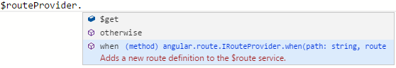
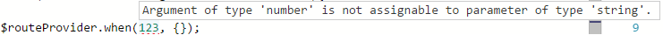
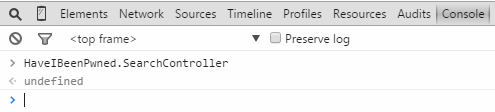
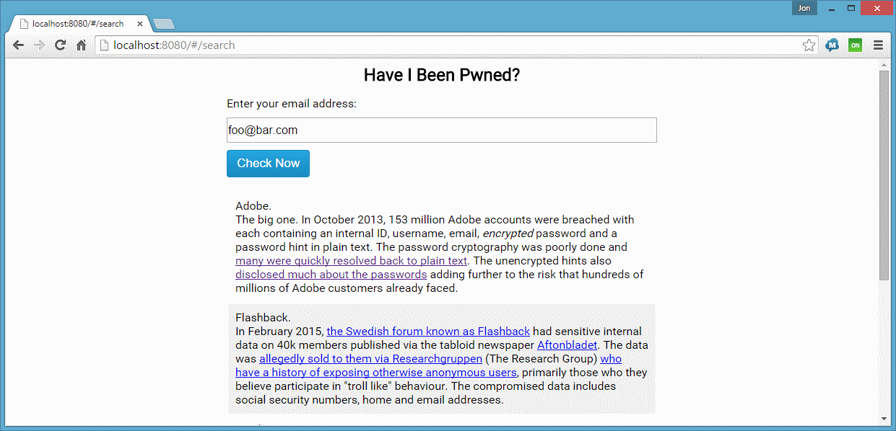

# Writing AngularJS 1.x with TypeScript

AngularJS 1.x is a front end JavaScript framework that has gained huge traction and popularity in the development community.  AngularJS greatly simplifies previously hard tasks like two-way data binding, templating, the MVC design pattern, despendency injection and more.  Using TypeScript, we can create more robust and scalable AngularJS code to deliver the ultimate user experience whilst avoiding the traditional spaghetti nightmare that these types of applications typically devolve in to.

AngularJS version 1.x is written in JavaScript.  Its successor, Angular 2.x, is written using TypeScript.  It was originally going to be written in Google's propriety language AtScript, but the teams have merged the projects and are now working together on TypeScript.

**Note**: This is not an AngularJS 101 tutorial.  I'm assuming that you have some knowledge of AngularJS and TypeScript and that you're looking to start using the two together to develop either a new project or enhance an existing project.

**Note**: This tutorial tries to stay editor independent, meaning the concepts apply to TypeScript specifically and not to a specific editor.  When appropriate, however, screenshots demonstrating how to implement the concepts discussed will be in [VS Code](https://www.visualstudio.com/en-us/products/code-vs.aspx).  VS Code is a free, cross platform editor hat has excellent built in TypeScript support. 

## Type Declaration Files
Also known as "Type Definition Files", these are files that have the extension **.d.ts** and contain all the information to, for lack of a better word, describe the structure of a JavaScript library. 

> "When using an external JavaScript library, or new host API, you'll need to use a declaration file (.d.ts) to describe the shape of that library."

<sub><sup>Referenced from the [TypeScript handbook](http://www.typescriptlang.org/Handbook#writing-dts-files).</sup></sub>

You will need to reference the AngularJS type declaration files for AngularJS to get full auto-completion/intelli-sense support and to be able to fully ultilise TypeScript's static typing functionality.

## Initial Setup
We're not going to develop an all-singing-all-dancing feature rich application here, perhaps I'll record a video that demonstrates how to do that at some point in the future.  We'll start off with exploring the basic concepts to get up and running quickly.

Before we can get started we're going to need to create a HTML page, a TypeScript file and stylesheet just to beautify things a bit.  We will also need to download AngularJS and the appropriate declaration files.  

### Task runner
Before we can do any of that, however, theres some configuration in VS Code that we need to do.  This same concept applies regardless of your editor.

1. Create a new directory somewhere, say on your desktop, called AngularJSAndTypeScript101.
2. Open VS Code, click **File > Open Folder...** and point to the directory you just created.
3. Click **File > New File...** and add the following code...

```json
{
    "compilerOptions": {
        "module": "none",
        "target": "ES5"
    },
    "files": [
        "app.ts"
    ]
}
```

Now you need to create a task runner.  A task runner will transpile your TypeScript each time you make any changes (so that you don't have to manually run tsc.exe every time!).

1. In VS Code, add a new file called 'app.ts'
2. Press <kbd>Ctrl</kbd>+<kdb>Shift</kdb>+<kdb>B</kdb> to trigger the transpiler.  VS Code will bring up a little message at the top of the screen telling you that there is no task runner configured.  Click the "Configure Task Runner" button.  VS Code will create a **tasks.json** file automatically for you.
3. Change the **args** property from **HelloWorld.ts** to **app.ts**.  We will revisit this later to take a wildcard selector.

Open your app.ts file, and add the following code;

```javascript
class Hello{
	constructor() {
		console.log("Hello!");
	}
}
```

Press  to kick off the build.  Once complete (it takes < 1 second on a half decent machine) you will notice a new file has been added to the project, called **app.js**.

Switch to split view by clicking the little side by side window icon on the top right hand side of the screen, and in the right hand pane open the newly generated **app.js** file.  This is optional of course, if you don't care about the compiled JavaScript, thats absolutely fine.  Sometimes its nice to be able to see it.

### Compile on save

If you have Node.JS tools installed, and you don't want the hassle of pressing <kbd>Ctrl</kbd>+<kdb>Shift</kdb>+<kdb>B</kdb> every single time you want to compile, you can do the following to enable compile on save;

1. Open a Node.js command prompt and change directory to the root folder for your project
2. Type the following command;

<pre>tsc -w app.ts</pre>

TypeScript will listen for changes to your file, and transpile it automatically every time you make a change (and save).  Sweet.

### Adding AngularJS
Next, we need to add AngularJS to our project.  You can do this using either Node Package Manager (NPM) or manually by download the appropriate files and adding them into your project folder.  VS Code is still pretty young at this point (July 2015) and support for pulling in packages automatically is non-existent.

#### Using NPM and Bower
If you don't already have bower, a client side package manager, installed you can use the following command from a Node.js command prompt;

<pre>npm i -g bower</pre>

This will install bower globally on your machine.  Now add a new file to your project called **bower.json** and add the following configuration:

```json
{
    "name": "AngularTypeScript101",
    "version": "1.0.0",
    "dependencies": {
        "angular": "~1.4.0",
        "angular-route": "~1.4.0"
    }
}
```

This will bring in version 1.4.0 of AngularJS.  Feel free to change this to use whatever the current version of Angular 1.x is.

Now run the following command;

<pre>bower install</pre>

This will download the packages and add them to your project folder under a sub directory called **bower_components**.

#### Using Visual Studio NuGet
If you happen to be following along using Visual Studio (full fat), you can easily install these packages using the following commands;  (which you run via the **Package Manager Console** PowerShell window.

<pre>install-package angularjs.core
install-package angularjs.route</pre>

You can use the same mechanism to easily update the packages too.

#### Manually
You can, of course, download Angular manually and add it to your project.  You will find the latest version on the [AngularJS](https://angularjs.org/) website.

You will probably find it easier to maintain your packages over time using Bower.

### Adding the type declaration files
Thankfully TypeScript has a built in mechanism for adding type declaration files to your project.  This is done using the TypeScript Definition Manager.

#### Using the TypeScript Definition Manager
You install the TypeScript definition manager using NPM.  Open a Node.js command prompt and enter the following;

<pre>npm i -g tsd</pre>

This will install the TypeScript definition manager globally.

The TypeScript declaration files are fully open source and can be found on the [Definitely Typed GitHub repo](https://github.com/borisyankov/DefinitelyTyped). The AngularJS declaration files can be installed using the following command;

<pre>tsd install angular
tsd install angular-route
</pre>

This will create a new directory called **typings** with a sub directory called **angularjs**.  Within will be the two Angular declaration files you just installed.

#### Using NuGet

You can install the declaration files by running the following command in the **Package Manager Console** Powershell window.

<pre>Install-Package angularjs.TypeScript.DefinitelyTyped</pre>

#### Manually

You could of course just download the declaration files directly from the GitHub repository and copy them into the correct folder.  (typings/angularjs)

### Referencing the declaration files
Now that you have installed the declaration files for Angular, flip back to your app.ts file and add the following code;

```javascript
class Hello{
	constructor() {
		angular.module("HelloApp", []);
	}
}
```

No matter which technique you use to compile your JavaScript, you will get the following error message; (I believe that support for this is going to be vastly improved in future versions of VS Code)

<pre>Cannot find name 'angular'</pre>

That's fine.  All we need to do is tell TypeScript about our declaration files by adding the following code to the very top of the code file;

```xml
/// <reference path="typings/angularjs/angular.d.ts" />
/// <reference path="typings/angularjs/angular-resource.d.ts" />
```

Many modern editors, including Visual Studio and Webstorm, don't require this additional step because they're smart enough to check for the existence of the **typings** sub folder.

Add the references, press <kbd>Ctrl</kbd>+<kdb>Shift</kdb>+<kdb>B</kdb> (or Save) to recompile and the error should go away.

## Web Server
AngularJS, like most other JavaScript libraries, won't work properly when viewed directly from the file system.  If you open a file on your desktop, the path will be something like this;

<pre>file:///C:/Users/jon.preece/Desktop/AngularTypeScript101/index.html</pre>

Chrome, Firefox, and most other web browsers won't allow you to consume other markup files due to security concerns (CORS).  With that in mind, you will need some sort of web server to "serve" up the files so they can be previewed properly in the browser.

VS Code does not have a built in HTTP server, so we must use another mechanism.  If you're using Visual Studio (full fat), then you can use the built in server and skip this step.

### Http-Server
There is a very nice HTTP server on NPM that is more than sufficient for our needs.  To install it, run the following command from a Node.js command prompt;

<pre>npm install -g http-server</pre>

This will install a simple HTTP server globally on your machine.  To, run the server CD to your root project folder and type the following command;

<pre>http-server</pre>

There are [lots of options](https://www.npmjs.com/package/http-server) you can pass in to customize the behaviour, but the default configuration will be enough for us. 

The default address is [http://localhost:8080](http://localhost:8080).

### IIS
You can configure IIS to host the site for you.  To do so, follow these steps;

1. Open the Internet Information Services (IIS) manager (inetmgr.exe)
2. Add a new site, call it "HaveIBeenPwnd"
3. Point the physical path to your project folder.
4. Enter the following host name: [haveibeenpwnd.local](http://haveibeenpwnd.local)
5. Open your hosts file (C:\Windows\System32\Drivers\etc\hosts) in your favourite text editor (VS Code if you like!)
6. Add the following line;

127.0.0.1   haveibeenpwnd.local

Open your web browser and point to [haveibeenpwnd.local](http://haveibeenpwnd.local).

## Sample Project

In order to demonstrate the concepts thoroughly, we are going to develop a simple project that utilizes the [HaveIBeenPwned API](https://haveibeenpwned.com/API/v2).  If you are not familiar with this service, [HaveIBeenPwned](https://haveibeenpwned.com/) is developed and maintained by [developer security expert Troy Hunt](http://www.troyhunt.com/).  HaveIBeenPwned checks to see if your email address or username has been compromised in a data breach.  The HaveIBeenPwned API is a way to access this wealth of information programmatically via a Restful endpoint.

The project shows how to write the following AngularJS concepts in TypeScript;

* Controllers
* Directives
* Filters
* Services
* Routing

The sample project is certainly not feature complete.  In fact, all the samples are about as simplistic as they can possibly be... but that's intentional.

### Style Guide
Whenever I write any AngularJS code, I always follow (with only minor deviation) the [Angular JS Style Guide](https://github.com/johnpapa/angular-styleguide), which was written by [John Papa](http://www.johnpapa.net/).  Its an excellent guide and I highly recommend that you check it out.

If you've never used a style guide before, just remember, a guide is exactly that... its a guide.  Use what bits make sense for your project.

### Project Structure

The structure of the project is as follows;

<pre>
/client
    /HaveIBeenPwned 
        /controllers
        /directives
        /filters
        /models
        /services
        /views
/content
    /css
/typings
    /angularjs
    /jquery
index.html
package.json
tsconfig.json
</pre>   

We will add in the appropriate files as we go along.

### Referencing typings files
At the time of writing, VS Code does not recognise the fact that you have added type declaration files to your project.  I suspect that in the future this will be resolved, but for now you have to manually reference the typings files directly in your TypeScript files.

Type declaration files are referenced using a special triple forward slash (///) syntax;

```xml
/// <reference path="../../typings/angularjs/angular.d.ts" />
/// <reference path="../../typings/angularjs/angular-route.d.ts" />
```

VS Code will now load in these files and provide intellisense/autocomplete based on the declarations made in each file.  If you are using Visual Studio, you can skip this step.

**Note**: It is out of the scope of this post to discuss how type declaration files work, we will cover this is a future post.

### Modules

When not using any sort of AMD, the default pattern that TypeScript generates is the IIFE pattern.  Take the following TypeScript code;

```javascript
class App{
	"use strict";
}
```

TypeScript generates the following;

```javascript
var App = (function () {
    function App() {
    }
    return App;
})();
```

This code is fine.  It works.  But there is one major problem.  TypeScript has placed a variable on the global scope.  A variable called App now exists on the <code>window</code> object.  In our case, its very unlikely that this would impact any other part of the application, but in larger projects with lots of scripts and external dependencies, this is a common problem.  TypeScript introduces modules to help avoid this problem and also help with the organization of your code.

Usage;
```javascript
module HaveIBeenPwned{
	"use strict";	
	class App{
				
	}
}
```

TypeScript generates the following;
```javascript
var HaveIBeenPwned;
(function (HaveIBeenPwned) {
    "use strict";
    var App = (function () {
        function App() {
        }
        return App;
    })();
})(HaveIBeenPwned || (HaveIBeenPwned = {}));
```

A global object is still added to the <code>window</code> object, but now our <code>App</code> class is added as a property on the <code>HaveIBeenPwned</code> object.  All classes that your wrap inside the <code>HaveIBeenPwned</code> module will be added as properties on the <code>HaveIBeenPwned</code>

Example;
```javascript
module HaveIBeenPwned{
	"use strict";
	class Routes {
		
	}
}
```

TypeScript generates the following code;
```javascript
var HaveIBeenPwned;
(function (HaveIBeenPwned) {
    "use strict";
    var Routes = (function () {
        function Routes() {
        }
        return Routes;
    })();
})(HaveIBeenPwned || (HaveIBeenPwned = {}));
```

As the <code>HaveIBeenPwned</code> object already exists, the <code>Routes</code> object will simply be added to it.

Add a file called **app.module.ts** to the **HaveIBeenPwned** folder, and add the following;

```javascript
module HaveIBeenPwned{
	"use strict";	

	angular
		.module("HaveIBeenPwned", ["ngRoute"]);
}
```

This will initalize the Angular app, and state that the is a dependency on the AngularJS route module.

**Point to take away**:  Modules help organise your code and stop the global scope from becoming polluted.

### Dependency injection for functions

Routing is the perfect place to start really leveraging the TypeScript awesomess in our application.  Routing configuration simply tells AngularJS where to find our views, and which controller to use for a specific path.

Routing is passed to AngularJS as configuration, using the <code>config</code> method.

Traditional AngularJS code;
```javascript
angular
    .module("HaveIBeenPwned")
    .config(["$routeProvider", function($routeProvider) { /*Routing goes here*/ } ]);
```

The traditional JavaScript way is to pass a list of dependencies as a string array, then the final parameter is a method in which those dependencies are injected.  TypeScript enables us to write this type of code in a much cleaner fashion.

You might be aware that with AngularJS, you can directly inject dependencies into a function by supplying a property called <code>$inject</code>.

Example;
```javascript
function routes(){
    
}
routes.$inject = ["$routeProvider"]
```

I've found that this is rarely used in practice...perhaps due to lack of knowledge of the feature or simply because most of the documentation shows how to use the traditional style shown above.

TypeScript lends itself well to using the <code>$inject</code> method.

Add a new file called **app.route.ts** to the **HaveIBeenPwned** directory, and add the following code;

```javascript
/// <reference path="../../typings/angularjs/angular.d.ts" />
/// <reference path="../../typings/angularjs/angular-route.d.ts" />

module HaveIBeenPwned {
    "use strict";

    function routes($routeProvider: ng.route.IRouteProvider){
    }

    routes.$inject = ["$routeProvider"]

    angular
        .module("HaveIBeenPwned")
        .config(routes);
}
```

Most of this code should look familar to you.  Technically, there is absolutely no reason why you can't use the traditional AngularJS style for passing dependencies to a function, I just find this syntax is much cleaner.

### Type declarations on function parameters

With this code we encounter the first usage of a type declaration;

```javascript
    function routes($routeProvider: ng.route.IRouteProvider){
```

First, take a look at the compiled output;
```javascript
    function routes($routeProvider) {
```

It's important to note that the type declarations are a TypeScript specific feature.  Type declarations are not a feature of JavaScript.  Type declarations are there to provide intellisense/autocomplete support and code refactoring, such as renaming of variables.

All AngularJS declarations can be found in the <code>ng</code> namespace.  In this case, we need the route provider to define our routing configuration.  Routing is not part of the core AngularJS library, in fact it was split out into its own module named **ngRoute**.  All typings for routing can be found in the <code>ng.route</code> namespace.

Add the following code to the <code>routes</code> method.  Please type the code rather than copy/paste it.

```javascript
$routeProvider
    .when("/search", {
        templateUrl: "/client/HaveIBeenPwned/views/_search.html",
        controller: "SearchController",
        controllerAs: "vm"
    })
    .otherwise({
        redirectTo: "/search"
    });
```
You should immediately see the benefits now.  



Not only do you get IntelliSense will full documentation, but you also get the added benefit of compile time checking;


In this case I have provided the wrong number of arguments to the method... I get instant visual feedback on that.  This also works if I pass an argument with the wrong type to the method;



In this case, I tried to pass a <code>number</code> to a method that was expecting a string.

**Note**: My code still compiled.  Even though the code I wrote in the above examples was *wrong*, the JavaScript was still generated and I could actually call that in the browser (all be it, with unpredicatable behaviour).

To complete the routing, add the following code to the <code>routes</code> method;

```javascript
$routeProvider
    .when("/search", {
        templateUrl: "/client/HaveIBeenPwned/views/_search.html",
        controller: "SearchController",
        controllerAs: "vm"
    })
    .otherwise({
        redirectTo: "/search"
    });
```

Don't worry about creating the views or controllers at this point.  We will do that later.

### Dependency injection for classes

Injecting dependencies into classes is slightly different.  With functions, we inject dependencies by tacking on a <code>$inject</code> variable directly onto the method name.  With classes, we instead have a <code>static</code> variable with the same name.

Example;
```javascript
static $inject = ["PwnedService"];
```

As with most other programming languages, <code>static</code> is not instance specific, it applies to all instances.  The generated JavaScript we end up is actually the same code as was generated for fuctions.

Example;
```javascript
SearchController.$inject = ["PwnedService"];
```

Add a new file to the **controllers** directory, named **search.ts**.  This will eventually be called to query the HaveIBeenPwned API and will act as the controller for our search view.
```javascript
module HaveIBeenPwned {
	class SearchController {
        static $inject = ["PwnedService"];
		constructor(private pwnedService: IPwnedService) {
            
		}
    }    
    
    angular
	   .module("HaveIBeenPwned")
	   .controller("SearchController", SearchController);
}
```

Don't forget to add the aforementioned typings files above the module declaration for full intellisense/autocomplete functionality.

**Note**: We don't have a <code>IPwnedService</code> yet, we'll get to that in a minute.

### Constructors

Constructors are a feature of ES6, called when an object is instantiated.  Again, constructors work the same in JavaScript as they do in any other programming language.

In the interest of cross-browser support, TypeScript generates method with the same name as the containing function to indicate that it's a constructor.

Example of an empty constructor in TypeScript;
```javascript
class SearchController {
	constructor() {
		//constructor logic	
	}
}
```

and the resulting JavaScript
```javascript
var SearchController = (function () {
    function SearchController() {
        //constructor logic	
    }
    return SearchController;
})();
```

Again, constructors are now natively supported in ES6 so when targeting that version the code won't be transpiled.

#### Understanding constructor parameters
Assume the following code;

```javascript
constructor($http : ng.IHttpService) {  
}
```

If you wanted to reuse the <code>$http</code> variable in other functions in your class, you might be tempted to do the following;

```javascript
private _httpService: ng.IHttpService;

constructor($http : ng.IHttpService) {
    this._httpService = $http;
}
```
You should understand that the act of assigning the constructor parameters to a private variable (like you might do in other languages) is redundant in TypeScript.  Under the hood TypeScript does this for you.

The following code is valid TypeScript;

```javascript
constructor($http : ng.IHttpService) {
    
}

someOtherFunction() {
    this.$http.get(...);   
}
```

This is valid because under the hood TypeScript created a variable on the class with the name <code>$http</code> inside the constructor and assigned the value automatically.

The transpiled JavaScript

```javascript
var PwnedService = (function () {
    function PwnedService($http) {
        this.$http = $http;
    }
    ...
}
```
Unless you explicity apply an access modifier to the parameter, its <code>public</code>.  You can add the <code>private</code> access modified to make that parameter only accessible with the class itself and not externally.  I typically mark all my constructor parameters a private unless I explicity need them to be accessible externally, although I'm not aware of any performance or other impact of not doing this.

### Make objects visible to others using 'Export'

The code shown in the previous example creates a controller called **SearchController**, using the ES6 <code>class</code> feature.  By default, the class is not accessible to any other external objects.  If you were to remove <code>constructor</code> parameter and run the code, open dev tools and run the following code, this would be the result;



It is desirable to expose certain objects so that they can be consumed in other places.  Generally I only expose objects that have to be exposed, but there is no hard and fast rule on this and no performance impact that I'm aware of, other than a slightly busier base module object.

To expose a class, interface, or function to other objects, use the <code>export</code> keyword.

```javascript
export class SearchController {
```

This makes a subtle change to the generated code.  This following line is added after the **SearchController** IIFE.

```javascript
HaveIBeenPwned.SearchController = SearchController;
```

Now re-running the code in dev tools results in the following;


**Note**:  This is a transformation provided by TypeScript and there is not a comparable feature in ES6 at the time of writing (July 2015).

### Interfaces

Interfaces are contracts that effectively promise that an object will contain the methods and properties defined therein.

Simple interface declaration;
```javascript
module HaveIBeenPwned{
	export interface IPwnedService {
		
	}
}
```

Note that the above code results in **zero** JavaScript output.  Why? simple, JavaScript does not support interfaces or contracts of any kind.  JavaScript is a dynamic language and properties/methods can be added to any object at any time.  Interfaces are syntatic sugar provided by TypeScript to support intellisense/autocomplete and compile time checking.

Add the following method to the interface (we will discuss promises shortly);
```javascript
check(address:string) : ng.IPromise<{}>;
```

An interface method has no implementation, that will be defined on the implementation class.

#### Naming conventions
The [official TypeScript style guide](https://github.com/Microsoft/TypeScript/wiki/Coding-guidelines) clearly states that interface names shouldn't be prefixed with **I**.  I come from a C# background and I'm simply too stuck in my old ways to adhere to this recommendation, and I know a lot of folk feel the same.  My advise to you, choose whatever naming convention makes the most sense to you, and stick with that.

Note also that I like to keep my interfaces and classes in the same physical file.  I recommend, again, that you pick an approach that works best for you, and then stick with that.

#### Working with interfaces

You can implement an interface on a class using the <code>implements</code> keyword as follows;

```javascript
class PwnedService implements IPwnedService
```

Flesh out the class as follows;

```javascript
module HaveIBeenPwned{	
	export interface IPwnedService {
		check(address:string) : ng.IPromise<{}>;
	}
	
	class PwnedService implements IPwnedService {
		
		static $inject = ["$http"];
		constructor(private $http : ng.IHttpService) {			
		}
		
		check(address:string) : ng.IPromise<{}> {			
		}		
	}
	
    angular
	    .module("HaveIBeenPwned")
    	.service("PwnedService", PwnedService);
}
```

If you add a property or a method to the interface, or change it, and forget to update the implementation class, you will get a compile time error.

You can also use interfaces with JSON.  Take the following TypeScript example;

```javascript
var a = <IMyInterface>{
  someValue: 'Hello'  
};
```

Instead of having to instantiate a class that implements the <code>IMyInterface</code> interface, you can exploit JavaScript's dynamic nature and pass in a raw JSON object.  Specifying the interface before the object is a hint to TypeScript of what you are doing.  In return, you will get full intellisense/autocomplete when defining the object, as well as compile time checking for all usages of that object.

Finally, you can also derive interfaces from other interfaces.  Interface inheritance if you like.  

Example;
```javascript
export interface IEnterKeyPressAttributes extends ng.IAttributes {
    ngEnter: string;   
}
```
The above example shows a new interface, that uses the <code>extends</code> keyword to derive from the <code>ng.IAttributes</code> interface.  The <code>IEnterKeyPressAttributes</code> interface has all the same methods and properties as the <code>ng.IAttributes</code> interface, and can add its own too.

## Promises
Promises are a new shiny feature in ES6.  Unfortunately, promises need to be supported either natively by the browser or via a polyfill.  AngularJS has promises baked right in to many components.   You can use promises indirectly, via a commom service such as <code>$http</code>, or you can create promises directly using <code>$q</code>.

Example;

```javascript
class PwnedService {
    constructor($q : ng.IQService) {
    }
    
    check() : ng.IPromise<{}> {
        var defer = this.$q.defer();
        //Do something useful
        //Then call either defer.resolve() or defer.reject()        
        return defer.promise;   
    }   
}
``` 

Or using <code>$http</code>:
```javascript
class PwnedService {
    constructor($http : ng.IHttpService) {        
    }
    
    check() : ng.IPromise<{}> {
        return this.$http.get("https://haveibeenpwned.com/api/v2/breachedaccount/" + address);    
    }   
}
```

In the interest of avoid the [promise anti-pattern](https://github.com/petkaantonov/bluebird/wiki/Promise-anti-patterns), I tend to use promises through other components, rather than directly and just chain on callbacks.

Anyway, whichever technique you prefer, you will end up defining <code>ng.IPromise<{}></code> as the return type for the parent function (see <code>check</code> method above).  

Technically, in TypeScript world, this is wrong.  I've basically said that the promise will return "an object" as yet to be determined.  However, I know what the correct type is;

```javascript
ng.IPromise<ng.IHttpPromiseCallbackArg<BreachedAccount[]>>
```

Why didn't I just write that in the first place?  I simply don't like the use of nested generics.  Sure I lose a little bit of intellisense and compile time checking, but I don't mind.

#### Calling a function that returns a promise
Flip back to the **SearchController.ts** file and add the following function;

```javascript
private breachedAccounts : BreachedAccount[];

submit(address: string) {
	this.pwnedService.check(address).then((result : ng.IHttpPromiseCallbackArg<{}>) =>{
		this.breachedAccounts = result.data;
	});
}
```

Theres no magic here, the code is the same as what you would write in JavaScript.  The only difference is that you get intellisense support on the <code>result</code> object.

### The 'any' type
Sometimes, a type isn't known until runtime.  This is especially true when calling a Web API back end.  The response you get when an exception is thrown by the runtime (unhandled) is very different than an exception thrown by your code.

A runtime exception object might look like this;

```javascript
{
    ...
    "Exception": {
        "Message": "Object reference not set to an instance of an object."   
    }   
    ...
}
```

Your code might return the following 'graceful' exception when an error is encountered.

```javascript
{
    ...
    "exception": {
        "message": "The request was malformed"   
    }   
}
```

The difference between these two responses.  Casing.  By default, the .NET runtime returns responses in Pascal Case.  You have to jump through several hoops to get the response to return in Camel Case, a step all so often not done fully.

In situations where type isn't known, use the <code>any</code> type;

```javascript
submit(address: string) {
	this.pwnedService.check(address).then((result : ng.IHttpPromiseCallbackArg<{}>) =>{
		this.breachedAccounts = result.data;
	})
	.catch((reason : any) => {
		alert(reason.Message || reason.message);	
	});
}
```

This will put an end to any compile time nagging.

#### --noImplicitAny

In the above example, we have explictly told TypeScript that <code>reason</code> does not have a tyoe.  With that in mind, do you think it's equally valid to leave off the type declaration altogether?  Absolutely, because the static typing in TypeScript is optional.

The following code is valid TypeScript;
```javascript
submit(address: string) {
	this.pwnedService.check(address).then((result : ng.IHttpPromiseCallbackArg<BreachedAccount[]>) =>{
		this.breachedAccounts = result.data;
	})
	.catch((reason) => {
		alert(reason.Message || reason.message);	
	});
}
```

No type was given for <code>reason</code>.  However, because the type is <code>any</code> is the type declaration files, its still explicit.

Take the following code;
```javascript
var y;
```

In this code there is no way that TypeScript can know what the type is, therefore it is implicity <code>any</code>.

If you want to prevent implicit use of the <code>any</code> type, you can pass in the <code>--noImplicitAny</code> flag to the TypeScript compiler when you execute it.

<pre>tsc --noImplicitAny -w</pre>

## Model classes
Add the following model class to the **models** folder;

```javascript
module HaveIBeenPwned {
	export class BreachedAccount {
		Title: string;
		Name: string;
		Domain: string;
		BreachDate: string;
		AddedDate: string;
		PwnCount: number;
		Description: string;
		DataClasses: string[];
		IsVerified: boolean;
		LogoType: string;
	}
}
```

This class will be used to map the response from the HaveIBeenPwned api back to an object for strong typing and compile time support.  This is the exact data is returned by the API, and it returns the properties in Pascal Case, so we will have to use that here (or write ugly mapping code, but I'd rather avoid that).

## Search View
Add a new file to the **views** folder called **_search.html**.  Add the following markup;

```html
<form ng-submit="vm.submit(vm.emailAddress)">
	<div>
		<label>Enter your email address:
			<input type="email" id="emailAddress" name="emailAddress" ng-model="vm.emailAddress" placeholder="you@yourdomain.com" ng-enter="vm.submit(vm.emailAddress)">
		</label>
	</div>
	<button type="submit">Check Now</button>
</form>
<table>
	<thead>
		<tr></tr>
	</thead>
	<tbody>
		<tr ng-repeat="breachedAccount in vm.breachedAccounts">
			<td>{{breachedAccount.Title}}. <div ng-bind-html="breachedAccount.Description | asHtml"></div></td>
		</tr>
	</tbody>
</table>
```

There are two things of particular interest here, the use of a custom directive called **ngEnter**, and a custom filter called **asHtml**.  

ngEnter directive;
```html
<input type="email" id="emailAddress" name="emailAddress" ng-model="vm.emailAddress" placeholder="you@yourdomain.com" ng-enter="vm.submit(vm.emailAddress)">
```

asHtml filter;
```html
<div ng-bind-html="breachedAccount.Description | asHtml"></div>
```

We will need to create both of these before we can continue.

## Filters

Filters are defined as follows;

> A filter formats the value of an expression for display to the user.

When we call out to the HaveIBeenPwned API, it will return an array of <code>BreachedAccount</code> to us.  Each <code>BreachedAccount</code> will have a property called <code>Description</code>.  This description is actually HTML markup that will contain links and other interesting stuff.

By default, AngularJS (very rightly so) will encode the string to make it safe.  The HTML markup will be rendered on the page, rather than added to the DOM and executed.  

We want to override this default behaviour, and actually render the HTML instead.  Generally speaking, I wouldn't recommend this approach because of the security implications (injection of potentially dangerous script) but in this small contrived example, its fine.  And lets be honest, its unlikely that Troy Hunt, *the* security guy, is going to have some malicious script sent to us.  Of course, you should never take this for granted.

Anyway, add a file called **ashtml.filter.ts** to the **filters** directory.  In terms of their behaviour, filters are much like the routing code we wrote earlier.

Add the following code;

```javascript
module HaveIBeenPwned{
	"use strict";
	
	export function asHtml($sce : ng.ISCEService) {
		return (text : string) => {
			return $sce.trustAsHtml(text);
		}
	}
	
	angular
		.module("HaveIBeenPwned")
		.filter("asHtml", asHtml);
		
	asHtml.$inject = ["$sce"];
}
```

Filters are defined by calling the <code>filter</code> method, passing in the name of the function and the function method name.

In order to force AngularJS to skip over encoding the description, we need to inject the <code>ng.ISCEService</code>, and call the <code>trustAsHtml</code> method.  The method will be called once the description value is known, and for each instance of <code>BreachedAccount</code> in the array.

## Directives

We need to create a new directive called **ngEnter**.  The purpose of this attribute, which will be attached to a text input field, will be to call a function on our controller when the user presses **Enter** on their keyboard.  This means that the user won't have to click the left button on their mouse to perform a search, they can do it straight from the keyboard.  The beauty of directives is that they can easily be used throughout your application.

The ngEnter attribute will take the name of the method to invoke when the user presses **Enter**.

Directives are slightly more involved than filters.  A typical directive in AngularJS consists of a <code>link</code> function, and a <code>require</code> variable (which determines how the directive is used).

If you want to learn about directives in depth, [The nitty-gritty of compile and link functions inside AngularJS directives](http://www.jvandemo.com/the-nitty-gritty-of-compile-and-link-functions-inside-angularjs-directives/) by Jurgen Van de Moere is a good read.

Start by defining a class, called <code>EnterKeyPressDirective</code>, and implement the ng.IDirective interface;

```javascript
class EnterKeyPressDirective implements ng.IDirective {
    
}
```

Doing this doesn't give us much.  In fact, if you take a look at the type declaration file all the methods and properties are optional;

```javascript
interface IDirective {
    compile?: IDirectiveCompileFn;
    controller?: any;
    controllerAs?: string;
    bindToController?: boolean|Object;
    link?: IDirectiveLinkFn | IDirectivePrePost;
    name?: string;
    priority?: number;
    replace?: boolean;
    require?: any;
    restrict?: string;
    scope?: any;
    template?: any;
    templateUrl?: any;
    terminal?: boolean;
    transclude?: any;
}
```

However, I'd say its a pretty good practice to include the interface.

The <code>link</code> function is called after the <code>compile</code> function.  The <code>link</code> function takes 4 parameters and doesn't return a value;

```javascript
link($scope: ng.IScope, elm: Element, attr: ng.IAttributes, ngModel: ng.INgModelController): void 
```

The value of ngEnter (the method to invoke) will be passed to us via the <code>attr</code> parameter.  The problem is, <code>ng.IAttributes</code> knows nothing about ngEnter.

Create a new interface that extends <code>ng.IAttributes</code>, and add the ngEnter property to it;

```javascript
export interface IEnterKeyPressAttributes extends ng.IAttributes {
    ngEnter: string;
}
```

Now replace <code>ng.IAttibutes</code> with <code>IEnterKeyPressAttributes</code>;

```javascript
link($scope: ng.IScope, elm: Element, attr: IEnterKeyPressAttributes, ngModel: ng.INgModelController): void {
    
}
```

And flesh out the method as follows;

```javascript
var element = angular.element(elm);
element.bind("keydown keypress", (event: JQueryEventObject) => {

    if (event.which === 13) {
        $scope.$apply(() => {
            $scope.$eval(attr.ngEnter);
        });

        event.preventDefault();
    }

});
```

We are using jqLite to subscribe to the elements <code>keydown</code> and <code>keypress</code> events.  Once a key is pressed, ensure its the enter key, and then call the function as defined by the ngEnter variable.

Also, we need to tell AngularJS that this directive requires an instance of **ngModel** and to restrict the directive so that it can only be used as an attribute.  Add the following code to the class;

```javascript
require = "?ngModel";
restrict = "A";
```

We finish with a hack.  I'm not sure if this is a bug in AngularJS, or expected behaviour.

Each time our directive is required, we need to ensure that a new instance of that directive is used.  Add the following static method;

```javascript
static instance(): ng.IDirective {
    return new EnterKeyPressDirective();
}
```

For reasons unclear, we have to take care of the leg work of creating a new instance of the directive, because AngularJS doesn't seem to take care of that for us.  

So when defining the directive, pass in the instance method instead of the class.  This will then be called each time AngularJS needs an instance of the directive, which will in turn ensure a new instance is created;

```javascript
angular
    .module("HaveIBeenPwned")
    .directive("ngEnter", EnterKeyPressDirective.instance);
```

We're good to go.

## Final steps

Add a new file to the root folder called **index.html**.  Also add a CSS file to the **css** folder, under **content**, called **site.css**.

Open **index.html** and add the following markup;

```html
<html>
	<head>
		<link href='http://fonts.googleapis.com/css?family=Roboto' rel='stylesheet' type='text/css'>
		<link href="content/css/site.css" rel="stylesheet"/>
	</head>
	<body ng-app="HaveIBeenPwned">
		<h1>Have I Been Pwned?</h1>
		
		<div class="container" ng-view>
			
		</div>
		
		<script src="bower_components/angular/angular.js"></script>
		<script src="bower_components/angular-route/angular-route.js"></script>
		<script src="client/HaveIBeenPwned/app.module.js"></script>
		<script src="client/HaveIBeenPwned/app.route.js"></script>
		<script src="client/HaveIBeenPwned/services/pwnedservice.js"></script>
		<script src="client/HaveIBeenPwned/controllers/search.js"></script>
		<script src="client/HaveIBeenPwned/models/breachedaccount.js"></script>		
		<script src="client/HaveIBeenPwned/filters/asHtml.filter.js"></script>	
		<script src="client/HaveIBeenPwned/directives/search.directive.js"></script>	
	</body>
</html>
```

This will pull in all the relevant scripts, fonts and styles.  It will also specify the name of the app (using the **ngApp** directive) and the view (using the **ngView** directive).

Open **site.css* and add the following styles;

```css
body{
	font-family: 'Roboto', sans-serif;
}
h1{
	font-size: 24px;
	text-align: center;
}

.container{
	width:50%;
	margin-left:auto;
	margin-right:auto;
}

input {
	width:100%;
	height:35px;
	font-size: 16px;
	margin:10px auto;
}

button {
	background: #25A6E1;
	background: -moz-linear-gradient(top,#25A6E1 0%,#188BC0 100%);
	background: -webkit-gradient(linear,left top,left bottom,color-stop(0%,#25A6E1),color-stop(100%,#188BC0));
	background: -webkit-linear-gradient(top,#25A6E1 0%,#188BC0 100%);
	background: -o-linear-gradient(top,#25A6E1 0%,#188BC0 100%);
	background: -ms-linear-gradient(top,#25A6E1 0%,#188BC0 100%);
	background: linear-gradient(top,#25A6E1 0%,#188BC0 100%);
	filter: progid: DXImageTransform.Microsoft.gradient( startColorstr='#25A6E1',endColorstr='#188BC0',GradientType=0);
	padding:8px 13px;
	color:#fff;
	font-family:'Helvetica Neue',sans-serif;
	font-size:17px;
	border-radius:4px;
	-moz-border-radius:4px;
	-webkit-border-radius:4px;
	border:1px solid #1A87B9;
	cursor: pointer;
}                

tr:nth-child(even){
	background-color:#eee;
}

tr td {
	padding:10px;
}
```

It's going to look functional, not beautiful.



Enter the test email address, **foo@bar.com** and press **Enter**.  You should get some sample data regarding breaches for that account.

## Summary

We looked, at a high level, at how to use TypeScript and AngularJS.  We looked modules, dependency injection, promises, filters and directives... the most common components of AngularJS 1.x applications.  TypeScript's static typing functionality makes compile time checking and refactoring possible, whilst allowing us to exploit ES5 goodness, resulting in cleaner more maintainable code.  We developed a sample application, that made us of the HaveIBeenPwned API to demonstrate these concepts.